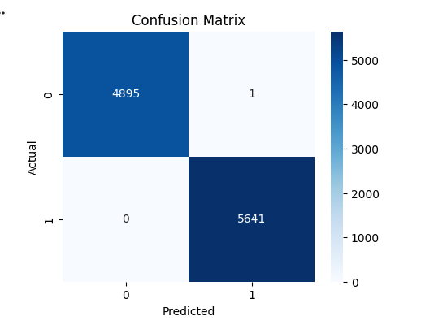
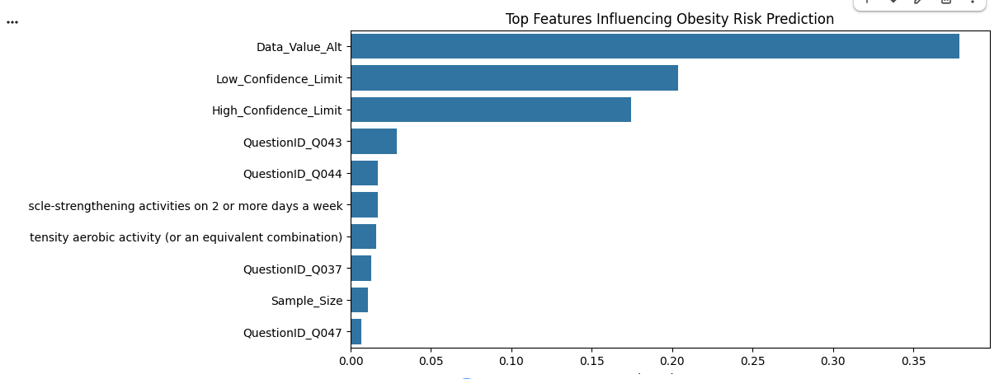

# Population-health-intelligence-system
AI-driven health analytics system that identifies obesity risk patterns across populations using machine learning on behavioral and demographic data
## Visual Insights

